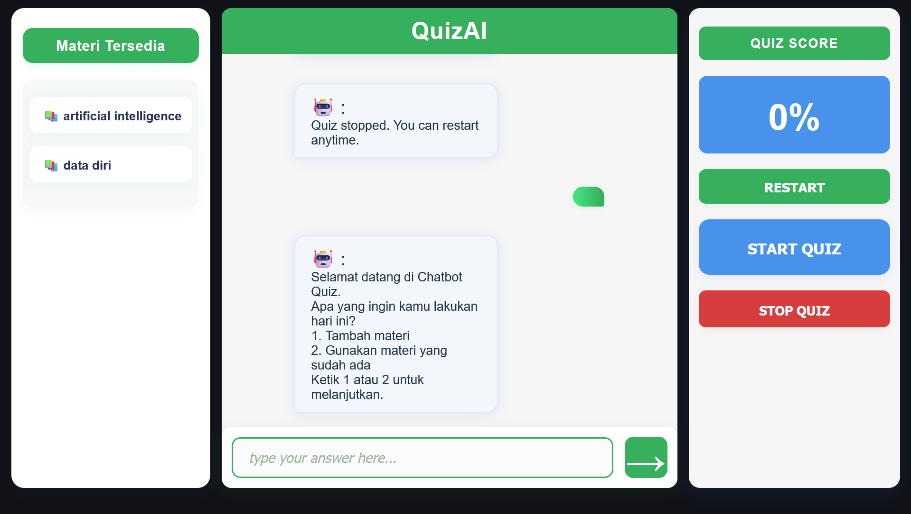

# AI Chatbot Quiz using Google Sheets API

A simple AI chatbot quiz application that uses Google Sheets as a backend database via Google Sheets API. Built to fulfill a university assignment (UTS).


## UI Preview
<p align="center">
  
</p>

## Features

- Add new quiz materi (topics) and questions through chatbot interface
- Take quizzes based on materi saved in Google Sheets
- User session management with multiple steps for smooth quiz flow
- Real-time score updates with percentage display
- Responsive web UI with chat bubbles and score panel

## Technologies Used

- Node.js with Express for backend API
- Google Sheets API for data storage and retrieval
- Vanilla JavaScript for frontend chat UI
- CSS Flexbox for responsive layout and styling

## Setup Instructions

1. Clone this repository:
```
git clone https://github.com/SidqiRaafi/Artificial-Intelligence_ProjectUTS_QuizAI.git
```
```
cd Artificial-Intelligence_ProjectUTS_QuizAI
```

2. Install dependencies:
```
npm install express cors body-parser googleapis
```


3. Obtain Google Service Account credentials JSON and save as `credentials.json` in root folder.

4. Run the backend server:
```
node server.js
```

5. Open `index.html` in your browser to use the quiz chatbot UI.

## Notes

- Do **NOT** commit your `credentials.json` to any public repository.
- Customize your Google Sheets ID in the backend code.
- Supports multi-user sessions with simple in-memory session store.


